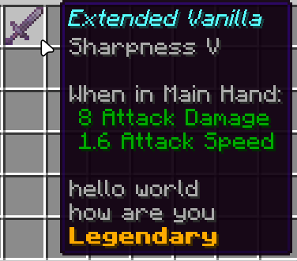
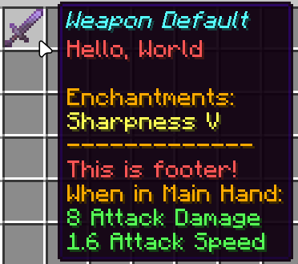
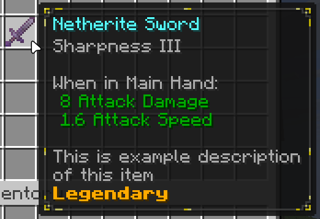

# Lore Template Engine

A paper plugin for defining custom item lore/tooltip layouts through config.

Items are tagged with a template ID (via PDC), and their lore is generated from that template whenever the item changes
(crafting, enchanting, admin commands, ...).

The config is split into three layers:

- **Variables** single values read from an item (`rarity`, `item_level`)
- **Groups** lists of values read from an item (`enchantments`, `tags`)
- **Templates** arrange variables and groups into an actual lore layout

---

## KDL

All config definitions are using kdl document language.

More info at https://kdl.dev

---

## Variables

A variable represents one value pulled from an item.

```kdl
variable "rarity" {
    source "pdc" key="rarity"
    lookup {
        "common" "<gray>Common"
        "uncommon" "<green>Uncommon"
        "rare" "<blue>Rare"
        "epic" "<light_purple><bold>Epic"
        "legendary" "<gold><bold>Legendary"
    }
    fallback "<gray>Unknown"
    default "<gray>Common"
}
```

**Properties**

| Property   | Required | Description                                                                                                                                |
|------------|----------|--------------------------------------------------------------------------------------------------------------------------------------------|
| `source`   | yes      | Where the raw value comes from. `pdc key="..."` reads a PersistentDataContainer tag; `computed fn="..."` calls a registered Java function. |
| `lookup`   | no       | Maps a raw stored value to display text. Only useful for enum-like values.                                                                 |
| `default`  | no       | Used when the PDC tag is missing entirely from the item.                                                                                   |
| `fallback` | no       | Used when the PDC tag exists but its value isnt in `lookup`.                                                                               |

More examples:

```kdl
variable "item_level" {
    source "pdc" key="item_level"
    default "1"
}

variable "owner_name" {
    source "pdc" key="soulbound_owner"
    default "<gray>Unbound"
}
```

A template references a variable with `var`:

```kdl
var "rarity"
var "item_level" prefix="<gray>Item Level: "
```

`prefix`/`suffix` wrap the variables rendered value with extra text at the point of use, without baking labels into the
variable definition itself.

---

## Groups

A group represents a list of values read from an item. Either builtin (engine reads it directly off the
`ItemStack`) or PDC-backed (admin-defined data stored as a delimited list).

Group definitions only describe the **data source**, never rendering.

```kdl
group "enchantments" {
    builtin "enchantments"
// exposes: <ench_name>, <ench_level>, <ench_level_roman>
}

group "attributes" {
    builtin "attributes"
// exposes: <attr_name>, <attr_value>, <attr_slot>, <attr_color>
}
```

Attribute groups can be pre-filtered by equipment slot, useful for rendering a vanilla-style "When on Head: / When in
Main Hand:" layout:

```kdl
group "attributes-main-hand" {
    builtin "attributes" slot="main-hand"
}

group "attributes-off-hand" {
    builtin "attributes" slot="off-hand"
}

group "attributes-any" {
    builtin "attributes" slot="any"
}

group "attributes-head" {
    builtin "attributes" slot="head"
}

group "attributes-chest" {
    builtin "attributes" slot="chest"
}

group "attributes-legs" {
    builtin "attributes" slot="legs"
}

group "attributes-feet" {
    builtin "attributes" slot="feet"
}
```

Admin-defined groups are backed by a PDC-stored list:

```kdl
group "tags" {
    source "pdc" key="tags" type="string_list"
    value-name "tag"
// exposes: <tag>
}

group "description" {
    source "pdc" key="description" type="string_list"
    value-name "line"
// exposes: <line>
}

group "abilities" {
    source "pdc" key="abilities" type="string_list"
    value-name "ability"
// exposes: <ability>
}
```

`value-name` sets the placeholder name usable inside a template `each` string. for `tags`, thats `<tag>`.

### Using a group in a template

```kdl
group "enchantments" each="<gray><ench_name> <ench_level_roman>" empty="skip"
```

| Property | Description                                                                                                |
|----------|------------------------------------------------------------------------------------------------------------|
| `each`   | Format string rendered once per element. Uses the group exposed placeholders, plus MiniMessage tags.       |
| `empty`  | What happens with zero elements. Currently: `skip` (render nothing).                                       |
| `joiner` | Optional separator string, used with `inline`.                                                             |
| `inline` | If `true`, all elements are joined into a single lore line using `joiner` instead of one line per element. |

---

## Templates

A template arranges variables, groups, literal text, and blank lines into a lore layout.

**Node types**

| Node                                  | Purpose                                                          |
|---------------------------------------|------------------------------------------------------------------|
| `text "..."`                          | A literal line. MiniMessage formatting only, no data lookup.     |
| `var "name"`                          | Renders a declared variable's value. Supports `prefix`/`suffix`. |
| `group "name" each="..." empty="..."` | Renders a declared group's elements.                             |
| `blank`                               | An empty lore line.                                              |

### Conditional lines with `collapse-if-empty`

Any node can take `collapse-if-empty="<group-id>". If that group rendered zero elements, the node itself is skipped.
This lets you write section headers and separators that only appear when there's actually something to show:

```kdl
template "weapon_default" {
    text "<red>Hello, World"
    
    blank collapse-if-empty="enchantments"
    text "<gold>Enchantments:" collapse-if-empty="enchantments"
    group "enchantments" each="<yellow><ench_name> <ench_level_roman>" empty="skip"
    text "<gold>-------------" collapse-if-empty="enchantments"
    
    blank collapse-if-empty="attributes"
    text "<gray>When in Main Hand:" collapse-if-empty="attributes-main-hand"
    
    group "attributes-main-hand" each=" <attr_color><attr_value> <attr_name>" empty="skip"
    text "<red>This is footer!"
}
```

If the item has no enchantments, the header, group, and divider all vanish. Only "Hello, World" and "This is footer!"
remain, with no leftover gap.

### A full "vanilla-style" tooltip template

```kdl
template "vanilla" {
    group "enchantments" each="<gray><ench_name> <ench_level_roman>" empty="skip"

    blank collapse-if-empty="attributes"
    text "<gray>When in Main Hand:" collapse-if-empty="attributes-main-hand"
    group "attributes-main-hand" each=" <attr_color><attr_value> <attr_name>" empty="skip"
    text "<gray>When in Off Hand:" collapse-if-empty="attributes-off-hand"
    group "attributes-off-hand" each=" <attr_color><attr_value> <attr_name>" empty="skip"
    text "<gray>When Equipped:" collapse-if-empty="attributes-any"
    group "attributes-any" each=" <attr_color><attr_value> <attr_name>" empty="skip"
    text "<gray>When on Head:" collapse-if-empty="attributes-head"
    group "attributes-head" each=" <attr_color><attr_value> <attr_name>" empty="skip"
    text "<gray>When on Chest:" collapse-if-empty="attributes-chest"
    group "attributes-chest" each=" <attr_color><attr_value> <attr_name>" empty="skip"
    text "<gray>When on Legs:" collapse-if-empty="attributes-legs"
    group "attributes-legs" each=" <attr_color><attr_value> <attr_name>" empty="skip"
    text "<gray>When on Feet:" collapse-if-empty="attributes-feet"
    group "attributes-feet" each=" <attr_color><attr_value> <attr_name>" empty="skip"
}
```

### Extending templates

`extends` reuses another template's nodes and appends new nodes after them:

```kdl
template "vanilla_extended" extends="vanilla" {
    blank collapse-if-empty="description"
    group "description" each="<gray><line>" empty="skip"
    var "rarity"
}
```

This renders everything from `vanilla`, then the description block, then rarity, in that order, since new nodes are
appended at the end.

### Resourcepack integration

`tooltip-style` applies tooltip-style data component to the item:

```kdl
template "vanilla_extended" extends="vanilla" tooltip-style="simple" {
	blank collapse-if-empty="description"
	group "description" each="<gray><line>" empty="skip"
	var "rarity"
}
```

---

## Applying a template to an item

Items reference their template via a single PDC tag (`template_id`). Whenever that item changes in a way
that should affect lore (enchanted, crafted, repaired, or set manually via command), the plugin rebuilds the lore from
the current template + current PDC/item data.

```
/lore set template weapon_default
/lore set variable rarity epic
/lore set group description Example description.\nThis will be on second line\nThird line
```

---

## Showcase






Tooltip texture source: [modrinth.com/resourcepack/simple-tooltip](https://modrinth.com/resourcepack/simple-tooltip)